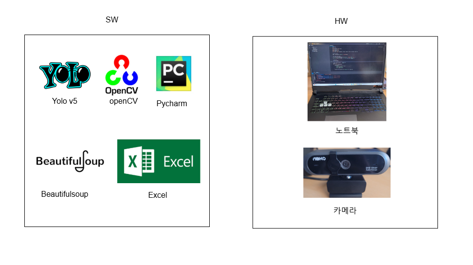
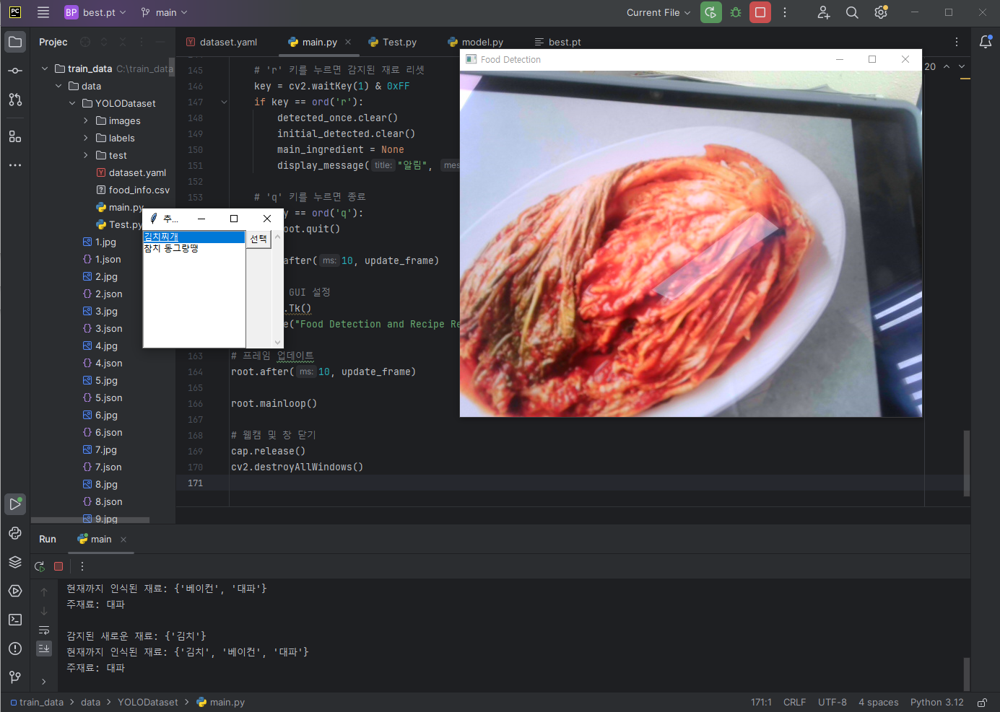
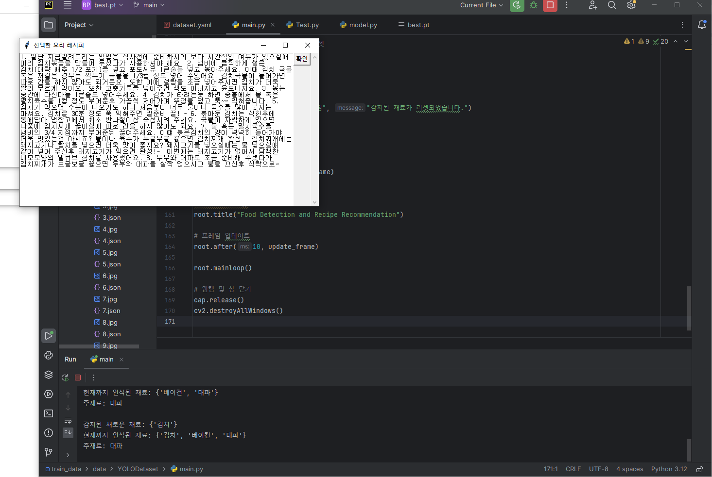

# 레시피 추천 프로그램: ARR

## 팀 정보
- **팀명:** ARR
- **지도 교수님:** 조용호 교수님
- **팀원:**
  - 김예찬 (193409): 카메라를 이용한 데이터 처리 및 코드 작성
  - 원준혁 (193423): 프로젝트 총괄 및 운영, 필요 물품 구입, 인공지능 딥러닝 구현
  - 장성민 (193436): 자료조사, 데이터베이스 및 알고리즘 코드 작성
  - 최진호 (193451): 자료조사 보조, 데이터베이스 및 구현 코드 작성

---

## 목차
1. 팀원별 역할
2. 개발일정
3. 목적계통도
4. 기능블록도 및 작품의 요약 설명
5. 설계 제한 요소
6. 사용 소프트웨어 및 하드웨어 목록과 설명
7. 작품 상세 설명 및 알고리즘
8. 자체 평가 및 소감
9. 참고자료 목록
10. 소스코드
11. 작품사진

---

## 1. 팀원별 역할
| 팀원     | 역할                              |
|----------|-----------------------------------|
| 김예찬    | 카메라를 이용한 데이터 처리 및 코드 작성 |
| 원준혁    | 프로젝트 총괄 및 운영, 필요 물품 구입, 딥러닝 구현 |
| 장성민    | 자료조사, 데이터베이스 및 알고리즘 코드 작성 |
| 최진호    | 자료조사 보조, 데이터베이스 및 구현 코드 작성 |

---

## 2. 개발일정


---

## 3. 목적계통도


---

## 4. 기능블록도 및 작품의 요약 설명
1. 노트북 카메라가 음식 재료를 인식합니다.
2. 인식된 음식 재료 데이터를 배열로 받습니다.
3. 데이터베이스와 비교하여 일치하는 레시피와 추가 재료가 필요한 레시피를 추천합니다.
   - 추가 재료가 필요한 경우 필요한 재료들을 보여줍니다.
4. 최종적으로 선택된 레시피를 텍스트로 보여줍니다.


---

## 5. 설계 제한 요소
| 제한 요소   | 설계 사양                                                          |
|------------|---------------------------------------------------------------------|
| 경제성     | 카메라만을 이용하여 비용 절감을 목표로 합니다.                       |
| 신뢰성     | 재료를 정확히 인식하여 사용자에게 적절한 레시피를 추천해야 합니다.     |
| 사회적 영향| 음식물 쓰레기 배출을 줄이는 것을 목표로 설계합니다.                   |
| 기능성     | 사용자가 쉽게 사용할 수 있도록 설계하였습니다.                      |


---

## 6. 사용 소프트웨어 및 하드웨어 목록
### 소프트웨어
- **YOLO** - 이미지 인식
- **OpenCV** - 이미지 처리
- **Pycharm** - 코드 작성 환경
- **BeautifulSoup** - 웹 스크래핑
- **Excel** - 데이터 관리

### 하드웨어
- **노트북**
- **카메라**



---

## 7. 작품의 상세 설명 및 알고리즘
1. 각종 레시피들을 모은 데이터베이스를 구축합니다.
2. 노트북 카메라를 이용하여 음식 재료를 객체 인식합니다.
3. 객체 인식된 음식 재료를 배열로 저장하여 데이터베이스와 비교 후 일치하는 레시피를 출력합니다.
4. 사용자가 원하는 레시피를 선택할 수 있으며, 해당 레시피를 GUI로 출력합니다.


---

## 8. 자체 평가 및 소감
- **팀원별 소감**  
  - **김예찬:** YOLO v8 커스텀 학습에 대한 이해를 높였으며, 이를 실생활에 적용해보는 좋은 경험이었습니다.
  - **원준혁:** 딥러닝 기술을 실생활 문제 해결에 적용하는 방법을 체험했습니다.
  - **장성민:** 객체 인식 학습자료 제작 과정을 이해하는 유익한 프로젝트였습니다.
  - **최진호:** 실시간 음식 재료 감지와 추천 요리 제공 과정이 흥미로웠으며, 추가 학습을 통한 인식 정확도 향상을 희망합니다.

---

## 9. 참고자료 목록
- [크롤링 하는 방법](https://otugi.tistory.com/393)
- [YOLO v5 설치 및 사용법](https://jeo96.tistory.com/entry/YOLOv5-설치-Pycharm)
- [딥러닝 프레임워크 GPU 사용법](https://jeo96.tistory.com/entry/Pytorch-CUDA-cuDNN-설치-windows-10)
- [텐서플로우 객체인식 방법](https://pseong.tistory.com/16)
- [라벨미를 통한 학습 데이터 제작 방법](https://made-by-kyu.tistory.com/entry/OpenCV-YOLOv8-커스텀-학습-데이터-만들기)

---

## 10. 소스코드

### 요리명 검색 및 CSV 파일 저장
```python
import requests, json
from bs4 import BeautifulSoup
import csv

def food_info(name):
    url = f"https://www.10000recipe.com/recipe/list.html?q={name}"
    response = requests.get(url)
    if response.status_code == 200:
        html = response.text
        soup = BeautifulSoup(html, 'html.parser')
    else:
        print("HTTP response error:", response.status_code)
        return
    food_list = soup.find_all(attrs={'class': 'common_sp_link'})
    if not food_list:
        print(f"'{name}'에 해당하는 음식을 찾을 수 없습니다.")
        return
    food_id = food_list[0]['href'].split('/')[-1]
    new_url = f'https://www.10000recipe.com/recipe/{food_id}'
    new_response = requests.get(new_url)
    if new_response.status_code == 200:
        html = new_response.text
        soup = BeautifulSoup(html, 'html.parser')
    else:
        print("HTTP response error:", new_response.status_code)
        return
    food_info = soup.find(attrs={'type': 'application/ld+json'})
    result = json.loads(food_info.text)
    ingredient = ','.join(result['recipeIngredient'])
    recipe = [f'{i + 1}. {step["text"]}' for i, step in enumerate(result['recipeInstructions'])]
    res = {'name': name, 'ingredients': ingredient, 'recipe': recipe}
    return res

def append_to_csv(values, filename='food_info.csv'):
    try:
        with open(filename, 'x', newline='', encoding='utf-8') as csvfile:
            writer = csv.writer(csvfile)
            writer.writerow(['음식 이름', '재료', '레시피'])  # CSV 헤더
            writer.writerows(values)
    except FileExistsError:
        with open(filename, 'a', newline='', encoding='utf-8') as csvfile:
            writer = csv.writer(csvfile)
            writer.writerows(values)
    print("CSV 정보가 파일에 성공적으로 추가되었습니다.")

# 사용자 입력 받기
food_name = input("검색하고 싶은 한국 음식 이름을 입력하세요: ")
food_details = food_info(food_name)
if food_details:
    print(f"음식 이름: {food_details['name']}")
    print(f"재료: {food_details['ingredients']}")
    print("레시피:")
    for step in food_details['recipe']:
        print(step)
    csv_values = [[food_details['name'], food_details['ingredients'], " ".join(food_details['recipe'])]]
    append_to_csv(csv_values)
else:
    print("음식 정보를 가져오는 데 실패했습니다.")
```

### YOLO 모델을 활용한 음식 재료 인식 및 레시피 추천
```python
import cv2
import torch
from ultralytics import YOLO
import pandas as pd
import tkinter as tk
from tkinter import messagebox, Listbox, Toplevel, Button, Scrollbar, END, Text

# YOLOv8 모델 로드
model = YOLO('C:/train_data/YOLOv8/runs/detect/train10/weights/best.pt', verbose=False)

# 데이터베이스 불러오기
df = pd.read_csv('food_info.csv', encoding='ANSI', sep=',')
df['재료'] = df['재료'].fillna('')

# 레시피 매핑
recipes = {}
for _, row in df.iterrows():
    recipe_info = {'ingredients': row['재료'].split(','), 'recipe': row['레시피'], 'name': row['음식 이름']}
    recipes[frozenset(recipe_info['ingredients'])] = recipe_info

# 레시피 추천 함수
def recommend_recipe(detected_ingredients, main_ingredient):
    detected_set = frozenset(detected_ingredients)
    recommended_recipes = [recipe['name'] for ingredients, recipe in recipes.items()
                            if len(ingredients & detected_set) >= 2 and main_ingredient in ingredients]
    return recommended_recipes if recommended_recipes else None

# Tkinter GUI 및 프레임 업데이트
root = tk.Tk()
root.title("Food Detection and Recipe Recommendation")
cap = cv2.VideoCapture(0)
def update_frame():
    global detected_once
    ret, frame = cap.read()
    if not ret:
        messagebox.showerror("오류", "웹캠에서 프레임을 읽을 수 없습니다.")
        return
    results = model(frame, verbose=False)
    detected_ingredients = set([model.names[int(detection.cls)] for result in results for detection in result.boxes])
    cv2.imshow('Food Detection', frame)
    key = cv2.waitKey(1) & 0xFF
    if key == ord('q'):
        root.quit()
    root.after(10, update_frame)
root.after(10, update_frame)
root.mainloop()
cap.release()
cv2.destroyAllWindows()
```

---

## 11. 작품사진


